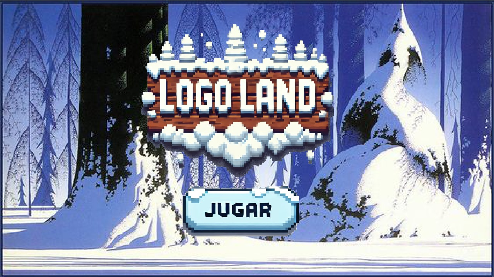
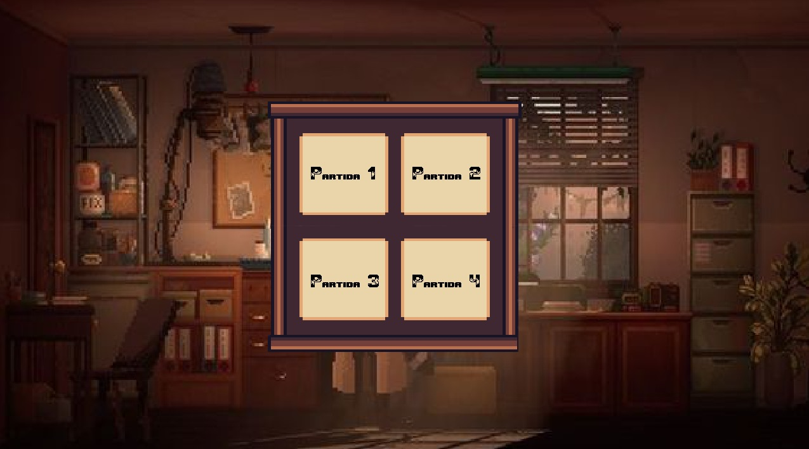
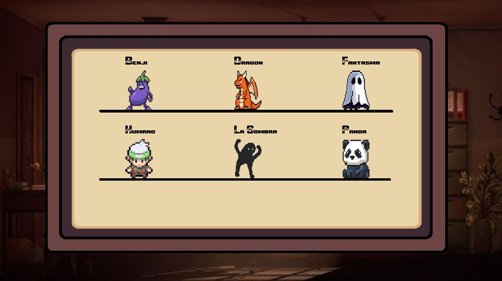
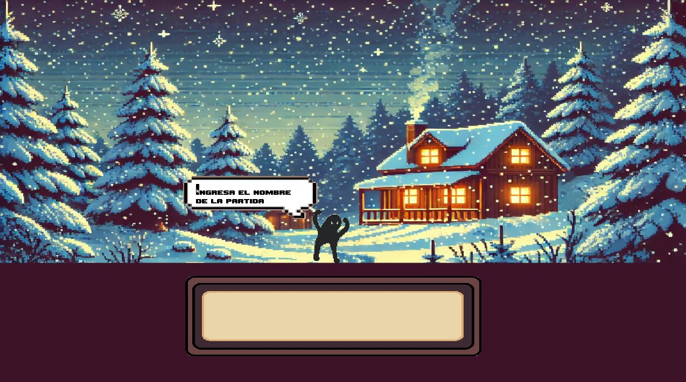
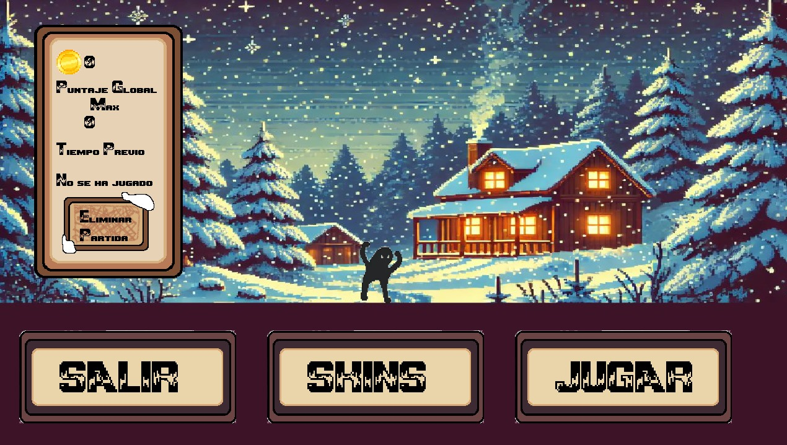
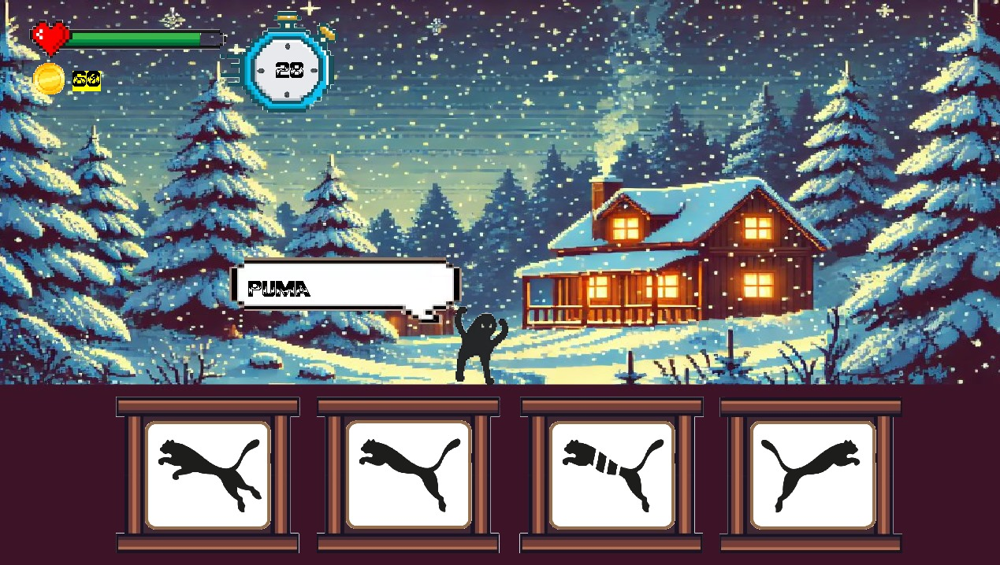
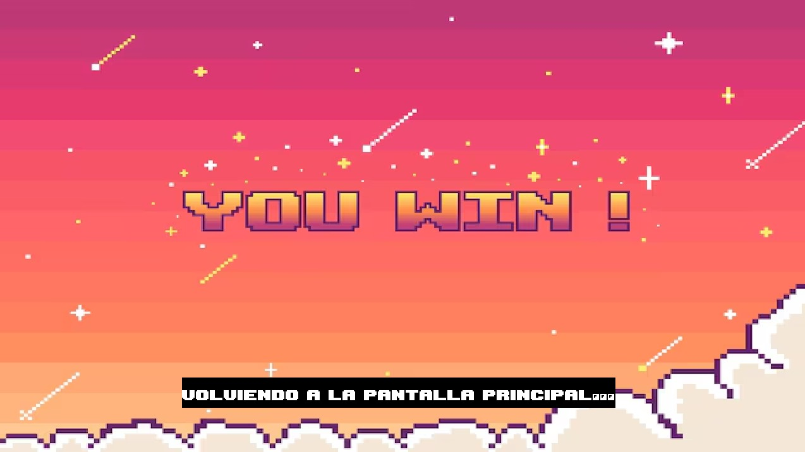
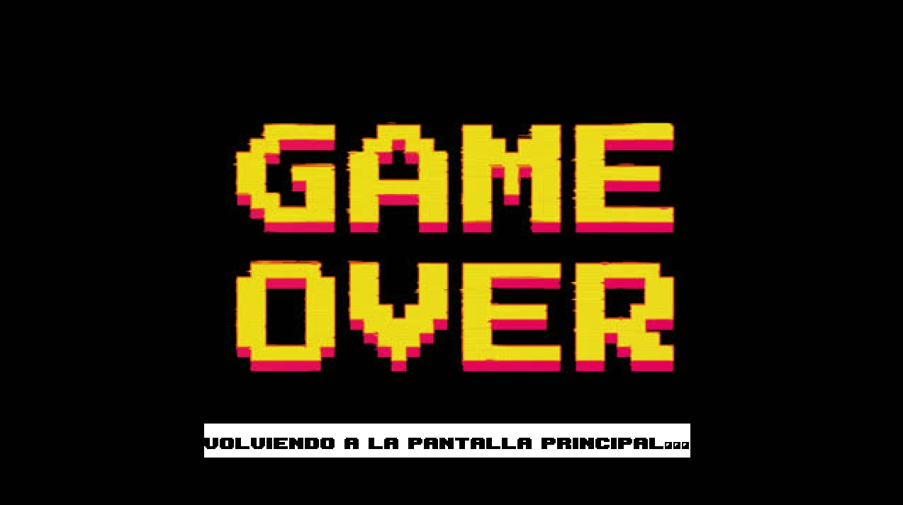

<h1>🎮 LOGO LAND</h1>

<strong>LOGO LAND</strong> es un juego desarrollado con <code>pygame</code> en el que deberás poner a prueba tus conocimientos sobre marcas reconocidas. 

<h2>🕹️ ¿Cómo se juega?</h2>
<ul>
  <li>Se te mostrarán varios logos por ronda.</li>
  <li>Tu misión es hacer clic en el logo correcto 10 veces para ganar.</li>
  <li>Tienes <strong>30 segundos</strong> por logo y <strong>5 vidas</strong> por partida.</li>
  <li>Acumula puntos por cada acierto.</li>
</ul>

<h2>🧭 Sala de espera</h2>

Antes de comenzar tu partida, pasarás por la <strong>sala de espera</strong>, donde puedes:

<ul>
  <li>🧍‍♂️ Elegir <strong>skins</strong> para personalizar tu experiencia de juego.</li>
  <li>📈 Ver tu <strong>puntaje actual</strong> de la última partida.</li>
  <li>🌍 Consultar el <strong>puntaje global</strong> (tu mejor puntaje guardado).</li>
  <li>🗑️ Usar la opción de <strong>eliminar partida</strong> para reiniciar tu progreso.</li>
</ul>

<h2>⚙️ Requisitos</h2>
<ul>
  <li>Python (versión 3.7 o superior)</li>
  <li>Librería <code>pygame</code></li>
</ul>

<h2>🚀 Instalación y ejecución</h2>
<ol>
  <li>Instala <a href="https://www.python.org/downloads/" target="_blank">Python</a> y <a href="https://code.visualstudio.com/" target="_blank">Visual Studio Code</a>.</li>
  <li>Clona este repositorio:</li>
  <pre><code>git clone https://github.com/Keruza3/Logo_Land_Game.git</code></pre>
  <li>Abre la carpeta del proyecto en Visual Studio Code.</li>
  <li>Instala las dependencias necesarias:</li>
  <pre><code>pip install pygame</code></pre>
  <li>Ejecuta el archivo <code>main.py</code>.</li>
</ol>

<h2>🖼️ Capturas de pantalla</h2>
<!-- Aquí puedes insertar imágenes con la etiqueta  -->

Próximamente...

  
  
  
  
  
  
  
  

<h2>📄 Licencia</h2>

  Este proyecto fue desarrollado por <strong>Keruza3</strong> y <strong>MatiVargados</strong>. Está disponible para que cualquier persona lo disfrute, use y mejore, pero <strong>los beneficios comerciales del juego solo podrán ser obtenidos por sus creadores originales</strong>.

  Queda prohibida la venta, monetización o distribución con fines de lucro por terceros sin autorización expresa de los autores.

<h2>👥 Créditos</h2>

Desarrollado por Keruza3 & MatiVargados.

